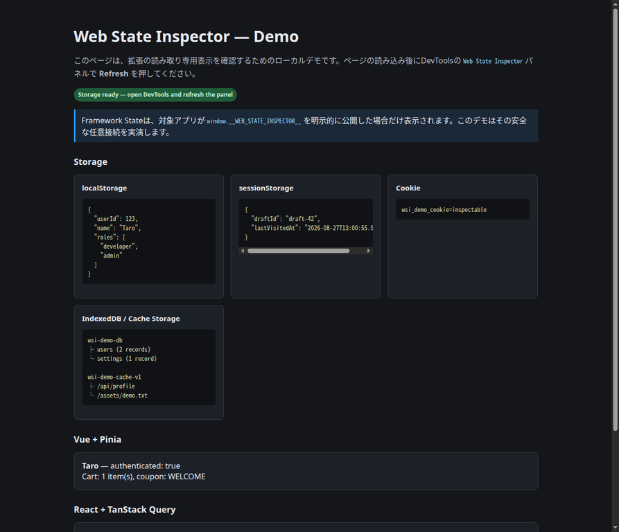
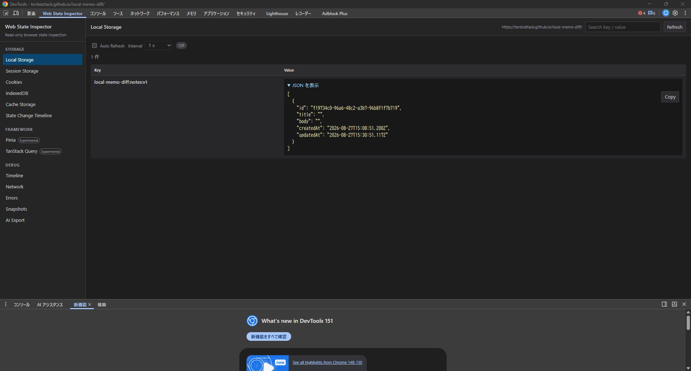

# Web State Inspector 詳細操作ガイド

Web State Inspectorは、Chrome DevToolsに追加する**読み取り専用のWeb状態確認およびAI向けデバッグコンテキスト収集ツール**です。現在のStorageを確認するだけでなく、明示的に開始したDebug Recordingで、利用者操作、SPA遷移、状態変化、通信、例外を同じ時系列へ集約します。AIへ自動送信する機能はなく、確認済みのMarkdownまたはJSONをクリップボードへコピーするだけです。

> このガイドの目的は「何でも収集するDevTools」を使うことではありません。再現・切り分けに必要な事実を、少量で順序立ててAIやチームメンバーへ渡すことです。Cookie、Storage、通信ヘッダー、request / response bodyには機密情報を含む可能性があるため、共有前に必ず内容を確認してください。

## 目次

| 節 | 内容 |
|---|---|
| [1. 導入](#1-導入) | `dist/`をChromeへ読み込む手順。 |
| [2. 画面の見方](#2-画面の見方) | サイドバー、Refresh、検索、Storage JSON表示。 |
| [3. 現在状態を確認する](#3-現在状態を確認する) | Storage、Cookie、IndexedDB、Cache、Framework State。 |
| [4. Storage変更を追跡する](#4-storage変更を追跡する) | State Change Timelineの記録・停止・制約。 |
| [5. AI向けDebug Recording](#5-ai向けdebug-recording) | User Action → State Change → Network → Errorの収集。 |
| [6. Snapshotと選択DOM](#6-snapshotと選択dom) | Before / After Diff、ラベル、`$0`の明示Capture。 |
| [7. AI Export](#7-ai-export) | 通常Exportと失敗イベント周辺だけの限定Export。 |
| [8. 制約とプライバシー](#8-制約とプライバシー) | 取得できない情報、上限、共有前の確認。 |
| [9. サンプルでの検証](#9-サンプルでの検証) | 同梱ページでの一連の操作。 |
| [10. トラブルシューティング](#10-トラブルシューティング) | よくある表示・取得上の問題。 |
| [11. iframe対応](#11-iframe対応) | Frame Lifecycle、Frame Filter、Cross-Origin制約、既知の制限。 |

## 1. 導入

### 1.1 開発版をChromeへ読み込む

リポジトリを取得し、依存関係と配布フォルダを用意します。`dist/`はChromeが読み込む完成済みの拡張フォルダです。

```bash
git clone https://github.com/tonbiattack/web-state-inspector.git
cd web-state-inspector
pnpm install
pnpm run build
```

続いて、Chromeの`chrome://extensions/`で**デベロッパーモード**を有効にし、**パッケージ化されていない拡張機能を読み込む**から、このリポジトリの`dist/`を選択します。任意のページでDevToolsを開くと、上部タブまたはオーバーフローメニューに**Web State Inspector**が現れます。

ソースを更新した場合は、`pnpm run build`の後、`chrome://extensions/`で拡張を再読み込みし、DevToolsも一度閉じて開き直してください。記録用のページ内フックはページ再読み込みで消えるため、再読み込み後は必要に応じて再度RecordまたはStart Recordingを押します。

### 1.2 操作対象と基本原則

| 原則 | 挙動 |
|---|---|
| 明示的な操作 | 変更履歴、Debug Recording、Snapshot、Selected DOMは、利用者が開始またはCaptureした場合だけ取得します。 |
| 読み取り専用 | 対象ページのStorage、Cookie、IndexedDB、Cacheを変更しません。 |
| ローカル処理 | AI API、外部サーバー、テレメトリーへ収集内容を送信しません。 |
| 最小収集 | 全DOM、無制限のconsole、Vue / React DevTools内部API、グローバルオブジェクトの総当たりは使用しません。 |

Storageや明示的な診断ブリッジの取得には、検査対象ページのJavaScript文脈を評価できる`chrome.devtools.inspectedWindow.eval()`を必要な箇所だけで使い、返値をJSON互換へ制限します。[1]

## 2. 画面の見方

パネル左側は、Storage、Framework、Debugの三分類です。右側上部には、現在開いている画面名、検査中ページURL、検索欄、**Refresh**があります。検索はStorage、Cookie、Timeline、Network、Errorsの表示中データを絞り込みます。Refreshは現在のカテゴリを明示的に再取得します。



上図は同梱の動作確認ページです。DevToolsのWeb State InspectorパネルでRefreshを押すと、このページが準備したStorage、Cookie、IndexedDB、Cache Storageを表示できます。

### 2.1 StorageのJSON表示とAuto Refresh

JSONとして解析できるStorage値は、各行の**JSON を表示**で展開できます。Copyは表示中の値をクリップボードへコピーします。JSONの展開状態はStorage種別とキー単位で管理するため、Auto Refresh、State Change Timeline / Debug Recording中の一覧追従、または手動Refreshで一覧が再描画されても、**展開済みのJSONを閉じずに最新値へ更新**します。



Auto RefreshはLocal StorageとSession Storageだけにあります。既定ではオフで、`500 ms`、`1 s`、`2 s`、`5 s`から間隔を選べます。State Change TimelineまたはDebug Recordingが実行中の場合は、Auto Refreshをオフにしても、表示中のStorage一覧を`700 ms`間隔で追従します。Cookie、IndexedDB、Cache Storage、Framework Stateは無制限にポーリングしません。

## 3. 現在状態を確認する

### 3.1 Local StorageとSession Storage

**Local Storage**または**Session Storage**を選び、必要に応じてRefreshを押します。各行はKeyとValueで表示され、JSON値は整形表示できます。KeyまたはValueの一部を検索欄へ入れると、現在の一覧内だけを絞り込めます。

| 目的 | 操作 | 得られる情報 |
|---|---|---|
| 現在の認証・選択状態を確認する | Local Storageを選択する。 | 文字列または整形JSONの現在値。 |
| タブ固有の下書きを確認する | Session Storageを選択する。 | 現在タブのSession Storage値。 |
| 値を追従する | Auto Refreshをオンにして間隔を選ぶ。 | 現在表示中一覧の再取得。 |
| 変更原因まで調べる | [State Change Timeline](#4-storage変更を追跡する)または[Debug Recording](#5-ai向けdebug-recording)を開始する。 | 記録開始後の変更前後、時刻、呼び出し元。 |

### 3.2 Cookies

**Cookies**では、Name、Value、Domain、Path、Expires、Secure、HttpOnly、SameSiteを表示します。Cookie取得は拡張のバックグラウンドで`chrome.cookies.getAll()`を使用し、`cookies`権限と対象ホストへの権限を必要とします。[2] Cookieの値は自動マスキングされないため、Copy for AIの前に特に注意してください。

### 3.3 IndexedDBとCache Storage

**IndexedDB**はデータベース、Object Store、レコード数のメタデータを表示し、Object Storeを選ぶと先頭100件までのレコードを読み取ります。**Cache Storage**はCache名を表示し、選択したCacheについてRequest URL、method、status、response typeを先頭100件まで表示します。両方とも現在状態の閲覧を目的としており、変更履歴は追跡しません。

### 3.4 PiniaとTanStack Query（Experimental）

Framework Stateは汎用的な自動探索ではありません。対象アプリケーションが、読み取り専用でJSON互換値を返す`window.__WEB_STATE_INSPECTOR__`を**明示的に公開した場合だけ**取得します。ブリッジがないアプリでは**Not detected**と表示され、それは異常ではありません。[3] [10]

```js
window.__WEB_STATE_INSPECTOR__ = Object.freeze({
  version: 1,
  getPinia: () => ({ selectedCustomerId: 123 }),
  getTanStackQuery: () => ([{ queryKey: ['customer', 123], status: 'success' }]),
});
```

このブリッジには、本当に診断で必要なJSON互換値だけを返してください。Vue / React DevToolsの内部APIや、`window`の無差別探索に依存しないことが安全性と互換性の前提です。

## 4. Storage変更を追跡する

**State Change Timeline**は、「いつ、どのStorage操作で、どの値からどの値へ変わったか」を見る専用画面です。AI向けのNetworkやErrorまで必要ない場合に、Storageだけを軽量に追跡できます。

1. **State Change Timeline**を開きます。
2. **Record**を押します。
3. 対象アプリを操作します。
4. 一覧でWhen、Storage、Operation、Key、Before → After、Whereを確認します。
5. 必要な記録を残したら**Stop**、不要になったら**Clear**を押します。

Record中は、ページのメインフレームで`Storage.prototype.setItem`、`removeItem`、`clear`を一時的にラップし、変更前後と短いスタックを記録します。`storage`イベントは変更を実行した同一ページでは発火せず、同一Storageを共有する別文書で発火するため、同一ページ内の操作追跡には標準メソッドの計測が必要です。[4] [5]

| 記録できること | 記録できない・注意点 |
|---|---|
| `setItem`、`removeItem`、`clear`、同一originの別文書から届く`storage`イベント。 | Record前の変更、ページ再読み込み後の過去イベント。 |
| Storage種別、キー、Before / After、`clear`時の最大100キー、呼び出し元。 | `localStorage.key = value`のようなプロパティ代入、iframe内の変更。 |
| 変更結果（changed / unchanged / error）。 | Cookie、IndexedDB、Cache Storageの変更履歴。 |

Stopは、拡張が設定したStorage計測フックだけを元へ戻します。対象ページが同じメソッドを後から差し替えた場合は、それを上書きしないようにしています。

## 5. AI向けDebug Recording

### 5.1 収集するイベント

**Debug / Timeline**で**Start Recording**を押すと、AIが不具合の前後関係を追えるよう、次のイベントを1本のUnified Timelineへ入れます。StopはページのStorage、History API、Consoleの計測フックを戻し、Clearは拡張側に保持した記録だけを削除します。

| 分類 | 収集対象 | 主な用途 | 上限 |
|---|---|---|---:|
| User Action | `click`、`input`、`change`、`submit`、focus / blur、`keydown`。 | 直前に利用者が何をしたかを追う。 | 200件 |
| Route Change | `pushState`、`replaceState`、`popstate`、`hashchange`。 | SPA遷移の前後URLを追う。 | 100件 |
| Storage | `setItem`、`removeItem`、`clear`、別文書のstorageイベント。 | 状態変化を操作・通信と並べる。 | Timeline合計1,000件 |
| Network | DevTools Network APIの完了Request。 | 4xx / 5xx、status 0、headers、取得可能なbodyを確認する。 | 500件 |
| JavaScript / Console | `error`、`unhandledrejection`、`console.error`、`console.warn`。 | 例外と明示的な警告を時系列化する。 | 200件 |

User Actionは高頻度の`mousemove`、`scroll`、`pointermove`を記録しません。`input`は要素ごとに350ms debounceし、password型の値は読まず`[not captured]`と記録します。Route ChangeはVue RouterやReact Routerの内部APIを使わず、標準History APIとブラウザイベントだけを対象にします。

### 5.2 基本ワークフロー

1. **Debug / Timeline**を開き、**Start Recording**を押します。
2. 不具合を再現します。操作、SPA遷移、Storage変更、Fetch / XHR、例外が記録されます。
3. Timelineで全体の流れ、Networkで通信詳細、Errorsでstackを確認します。
4. 必要なら、再現前後にSnapshotを取り、Selected DOMをCaptureします。
5. AI Exportで通常Exportまたは限定Exportをコピーし、内容を確認してからAIへ貼り付けます。
6. 作業後は**Stop**を押します。

Unified Timelineは、Networkとページ側フックの`performance.now()`原点が同じではないため、**ISO 8601 timestamp順**で並べます。`[possibly related to …]`は、User Actionの後0〜1.5秒に起きたイベントを補助表示するだけで、因果関係を証明しません。

### 5.3 NetworkとErrorsの読み方

**Debug / Network**では、All、Fetch/XHR、Error only、4xx / 5xxで表示を絞り込めます。Network情報は`chrome.devtools.network.onRequestFinished`が提供する完了済みHAR情報を基にします。[6] response bodyは`getContent()`で得られたときだけ保存し、1件あたり最大100KiBで切り詰めます。HARにはrequest bodyが常に含まれるわけではないため、取得不可の場合は理由を表示します。

各通信の **Headers / body** を開くと、**Copy request / response** でmethod、URL、status、headers、request body、response bodyをまとめてコピーできます。response bodyを取得できた通信では、**Copy response body** で本文だけをコピーできます。コピー処理はローカルのクリップボードだけを使い、値のマスクや外部送信は行いません。

HTTP 404や500はFetchのPromiseを通常rejectしないため、通信失敗としてはstatusも確認してください。[7] Debug RecordingはStart Recording以降の完了Requestを対象にするため、DevToolsを開く前や記録開始前の通信は残っていない場合があります。

**Debug / Errors**は、`error`、`unhandledrejection`、`console.error`、`console.warn`を表示します。`console.log`は記録しません。未処理Promise rejectionはグローバルの`unhandledrejection`として通知されますが、クロスorigin由来のrejectionはプライバシー制約により取得できない場合があります。[8]

## 6. Snapshotと選択DOM

### 6.1 Before / After Snapshot

**Debug / Snapshots**では、ラベル付きの状態スナップショットを作成できます。たとえばBefore labelを`ログイン前`、After labelを`500発生後`として、再現操作の前後でCaptureします。

1. Before labelへ意味の分かる名前を入力します。
2. **Capture Before**を押します。
3. 不具合を再現します。
4. After labelを入力し、**Capture After**を押します。
5. **Show Diff**を押します。

DiffはJSON互換の値を再帰的に比較し、追加、削除、変更を表示します。対象はPage、Environment、Web Storage、Cookie、IndexedDB / Cache Storageのメタデータ、明示的ブリッジ経由のFramework Stateです。ラベルは画面とAI ExportのSnapshot Diff見出しへ表示されます。

### 6.2 Selected DOM Snapshot

ページ全体のHTMLは収集しません。Elementsパネルで確認したい要素を選び、Web State Inspectorの**Capture Selected Element**を押してください。DevTools Console Utilitiesで選択要素を指す`$0`から、その**1要素だけ**をJSON互換の最小Snapshotへ変換します。[9] [1]

| 含める情報 | 含めない情報 |
|---|---|
| tag名、selector、id / class / name / type、短縮text、ARIA、data-testid。 | ページ全体のDOM、無差別な子孫走査、`document.documentElement.outerHTML`。 |
| 必要属性、dataset、disabled / hidden、矩形、重要computed style。 | 自動的な全要素収集、Elementsで選択していない要素。 |

選択要素は最新3件まで保持します。Elementsで何も選ばれていない場合は、先にElementsパネルで対象を選択するよう案内されます。

## 7. AI Export

### 7.1 通常Export

**Debug / AI Export**へ進み、Expected Result、Actual Result、Reproduction Steps、Additional Notesを入力します。MarkdownまたはJSONを選び、**Copy for AI**を押します。Snapshotが1件もない場合は、`Current state`ラベルのSnapshotを1件だけ取得してから出力します。

Markdownは次の順で作られます。AIが最初に再現条件と明確な失敗を読み、その後で時系列と状態を確認できる順序です。

| 順序 | 章 | 内容 |
|---:|---|---|
| 1 | Reproduction Notes | Expected / Actual / Steps / Notes。 |
| 2 | JavaScript and Console Events | error、rejection、console.error、console.warn。 |
| 3 | Network Errors | 4xx / 5xx、status 0、収集エラー。 |
| 4 | User Actions | 操作と対象要素の最小要約。 |
| 5 | Route Changes | SPA遷移の前後URL。 |
| 6 | Storage Changes | Before / Afterと呼び出し元。 |
| 7 | Unified Timeline | ISO timestamp順の全イベント。 |
| 8 | Snapshot Diff | ラベル付きの状態差分。 |
| 9 | Current State | Page、Environment、件数、選択DOM。 |

### 7.2 失敗イベント周辺だけの限定Export

長い記録をそのまま渡す必要がない場合は、**失敗イベントを中心にした限定Export**を使います。

1. Timeline、Network、またはErrorsで、失敗行の**Export around event**を押します。
2. AI Export画面でFailure eventを確認します。
3. Seconds beforeとSeconds afterを設定します。既定値は**前5秒・後2秒**で、0〜60秒に変更できます。
4. **Copy focused context**を押します。

選択できるのは、HTTP 4xx / 5xx、status 0、`javascript-error`、`console-error`、`promise-rejection`です。`console.warn`は通常Exportには含まれますが、単独では失敗イベントの起点にしません。

限定Exportには、選択イベント、時間窓、範囲内のTimeline、Network、Error、User Action、Route Change、Storage Change、Selected DOMだけを含めます。開始または完了時刻が窓と重なるNetworkは、失敗通信のheadersや取得可能なbodyを失わないように含めます。Snapshot本体とBefore / After Diffは時間窓外の情報を混ぜないため除外し、Page / Environmentメタデータだけを残します。

> 「前後N秒」は時刻近接による切り出しです。選択した失敗が周辺イベントの原因であること、または周辺イベントが失敗の原因であることを意味しません。

## 8. 制約とプライバシー

### 8.1 取得範囲と意図的な非対応

| 対象 | 取得範囲 | 主な制約 |
|---|---|---|
| Local / Session Storage | 現在値と記録開始後の標準メソッドによる変更。 | 記録開始前、プロパティ代入、iframe内の変更。 |
| Cookie | 権限範囲で取得できる現在値。 | 自動マスキングはしない。 |
| Network | 完了RequestのHAR情報と取得可能なresponse body。 | WebSocket、SSE、Service Worker内通信、確実なrequest body取得。 |
| JavaScript / Console | メインフレームのerror、rejection、console.error、console.warn。 | console.log、Worker専用例外、クロスorigin制約を受けるrejection。 |
| Selected DOM | 明示選択した`$0`の最小Snapshot。 | 全DOM、outerHTML、選択前の自動取得。 |
| Framework State | 明示ブリッジが返すJSON互換値。 | DevTools内部API、無差別なグローバル探索。 |

### 8.2 共有前の確認

> **Copy for AIの前に、必ず出力内容を確認してください。** Cookie、Authorization、access token、個人情報、顧客情報、非password入力値、request / response body、Selected DOMの属性やtextが含まれる可能性があります。拡張は外部送信も自動マスキングも行いません。

信頼できる開発・検証環境で使ってください。Debug RecordingおよびState Change Timelineはページへ一時的な計測フックを設定します。Stopで元のメソッドへ復元しますが、計測中にアプリがメソッドを上書きする可能性はあります。

### 8.3 メモリと出力の上限

| バッファまたは出力 | 上限 |
|---|---:|
| Unified Timeline | 1,000イベント |
| User Action | 200件 |
| Route Change | 100件 |
| Network | 500件 |
| Error / Console | 200件 |
| response body | 100KiB / 件 |
| 通常AI Export | Timeline 200件、Network 100件、Error 50件、Storage 100件 |
| Selected DOM Snapshot | 3件 |
| IndexedDB / Cache表示 | StoreまたはCacheごとに100件 |

上限に達した記録は、古いイベントから破棄します。必要な不具合だけを短時間で再現し、直後に限定Exportを作る運用を推奨します。

## 9. サンプルでの検証

リポジトリには、Storage、Framework State、Network、Error、User Action、Route Changeを試せるページがあります。

```bash
node scripts/serve.mjs
# http://localhost:4173/sample/
```

ChromeでこのURLを開き、DevToolsのWeb State Inspectorを選択してください。次のシナリオで、基本機能からAI Exportまでを一通り確認できます。

| シナリオ | パネルでの操作 | サンプルページでの操作 | 期待する結果 |
|---|---|---|---|
| Storage閲覧 | Local Storage → Refresh。 | 初期表示を待つ。 | `wsi.demo.user`などのJSONを表示。 |
| Auto Refresh | Local Storage → Auto Refreshをオン。 | Storage操作ボタンを押す。 | 値が追従し、展開済みJSONは閉じない。 |
| Storage追跡 | State Change Timeline → Record。 | `localStorage.setItem`、更新、remove、`sessionStorage.clear`。 | Before / After、操作、発生元を表示。 |
| Framework State | PiniaまたはTanStack Queryを選ぶ。 | 追加操作は不要。 | サンプルの明示ブリッジ経由でDetected。 |
| AI Debug Context | Timeline → Start Recording。 | Customer ID入力、`console.warn`、Action → State → Network → Error。 | Action、Storage、pushState、Fetch 500、console-errorがUnified Timelineへ入る。 |
| 限定Export | NetworkまたはTimelineの500行でExport around event。 | 追加操作は不要。 | 前5秒・後2秒のFocused Failure Windowをコピー。 |
| Snapshot / DOM | SnapshotsでBefore / AfterとCapture Selected Element。 | Elementsで`#debug-journey`などを選択。 | ラベル付きDiffと選択要素だけのSnapshotを表示。 |

## 10. トラブルシューティング

| 症状 | 確認・対処 |
|---|---|
| Web State Inspectorタブが見つからない | `chrome://extensions/`で拡張が有効か確認し、DevToolsを閉じて開き直します。必要に応じて上部タブのオーバーフローメニューも確認します。 |
| 変更したコードが反映されない | `pnpm run build`後に拡張を再読み込みし、DevToolsを再起動します。 |
| Storage一覧が古い | Refreshを押すか、Local / Session StorageならAuto Refreshを有効にします。 |
| JSONが閉じる | 最新の拡張へ再読み込みしてください。JSON詳細の展開状態は再描画後もキー単位で保持されます。 |
| Timelineが空 | 記録前のイベントは遡及できません。RecordまたはStart Recordingを押してから再現してください。 |
| Network bodyが表示されない | DevToolsがbodyを提供しない場合があります。Not availableの理由を確認し、Networkパネルの詳細も併用してください。 |
| Pinia / TanStack QueryがNot detected | 対象アプリが明示的な`window.__WEB_STATE_INSPECTOR__`ブリッジを公開していない状態です。内部API探索は行いません。 |
| Capture Selected Elementが失敗する | 先にElementsパネルで対象ノードを選択してから、Capture Selected Elementを押します。 |
| 限定Exportの選択肢がない | 4xx / 5xx、status 0、JavaScript Error、console.error、Promise rejectionを記録してから開きます。console.warn単独は選択対象外です。 |

## 11. iframe対応

Debug Recordingは、メインフレームだけでなくページ内のiframeも監視対象にできます。iframe内で発生したイベントも、Unified Timeline上でメインフレームのイベントと同じ時系列に統合されます。

### 11.1 何が記録されるか

* **Frame Lifecycle**: iframeの追加(Frame Added)・遷移(Frame Navigated)・削除(Frame Removed)を`chrome.webNavigation`経由で検知し、Timelineへ記録します。各イベントには`FrameInfo`(frameId、parentFrameId、url、origin、isMainFrame、isCrossOrigin)が付与されます。
* **Cross-Origin JavaScriptエラー**: Same-Origin Policyにより詳細が取得できないエラー(ブラウザが`"Script error."`として報告するもの)は、推測で内容を補完せず、`Cross-origin error: Details unavailable`として明示的に記録します。
* **Frame Filter**: Debug Timeline画面にFrame Filterのドロップダウンが追加されており、「All / Main Frame / 各iframe」で絞り込み表示できます。各Timeline行にはどのフレームで発生したかを示す小さなラベルが付きます。
* **AI Export**: Copy for AIの出力には`## Frames`セクションが追加され、記録中に検出したMain Frameおよびiframeの一覧(URL付き)が含まれます。また各Timeline行には`[Main]`や`[iframe ...]`のようなフレームラベルが付与されます。

### 11.2 既知の制限

* **User Action / Storage Change / JavaScriptエラーそのものへのフレームタグ付け**: これらは現状、メインフレームからの`chrome.devtools.inspectedWindow.eval`によるポーリングで収集しているため、iframe内で発生した個別イベント自体に発生元frameのタグを付ける機能は未実装です(iframeごとに独立したcontent scriptからのイベントpush方式への再設計が必要なため、MVPスコープ外としています)。iframeの追加・遷移・削除自体(Frame Lifecycle)はTimelineに正しく統合されます。
* **Frame Removedの検知**: Chrome拡張機能にはiframeが削除されたことを直接通知するAPIがないため、トップレベルページの遷移開始(`onBeforeNavigate`)をもって、その時点の子フレームをまとめて「削除」とみなす近似的な検知を行っています。ページ内でJavaScriptにより動的にiframeが削除されるケースは検知対象外です。
* **Cross-Originのフレームアクセス**: 拡張機能のhost permissionが及ばない、あるいはブラウザのSame-Origin Policyにより取得できない情報は、推測で埋めず「取得不可」として扱います。権限は自動的に拡張されません。
* **Service Workerの再起動**: フレームツリーの情報はService Worker上のメモリにキャッシュされているため、Manifest V3のService Workerが休止・再起動した場合、その間のフレーム情報が一時的に失われることがあります。

### 11.3 動作確認用サンプル

`sample/iframe-demo.html`(親ページ)と`sample/iframe-content.html`(Same-Origin iframe)を同梱しています。Debug Recording開始後、iframe内のボタン操作・Storage変更・Route Change・console.errorをそれぞれ発生させ、Unified Timelineに統合表示されること、Frame FilterでiframeだけをTimeline上で絞り込めること、Copy for AIの出力にFrame情報が含まれることを確認できます。

## 参考資料

[1]: https://developer.chrome.com/docs/extensions/reference/api/devtools/inspectedWindow "chrome.devtools.inspectedWindow | Chrome for Developers"
[2]: https://developer.chrome.com/docs/extensions/reference/api/cookies "chrome.cookies | Chrome for Developers"
[3]: https://devtools.vuejs.org/getting-started/features "Features | Vue DevTools"
[4]: https://developer.mozilla.org/en-US/docs/Web/API/Window/storage_event "Window: storage event | MDN Web Docs"
[5]: https://developer.mozilla.org/en-US/docs/Web/API/Web_Storage_API/Using_the_Web_Storage_API "Using the Web Storage API | MDN Web Docs"
[6]: https://developer.chrome.com/docs/extensions/reference/api/devtools/network "chrome.devtools.network | Chrome for Developers"
[7]: https://developer.mozilla.org/en-US/docs/Web/API/Fetch_API/Using_Fetch "Using the Fetch API | MDN Web Docs"
[8]: https://developer.mozilla.org/en-US/docs/Web/API/Window/unhandledrejection_event "Window: unhandledrejection event | MDN Web Docs"
[9]: https://developer.chrome.com/docs/devtools/console/utilities/ "Console utilities API reference | Chrome for Developers"
[10]: https://tanstack.com/query/latest/docs/framework/react/devtools "Devtools | TanStack Query"
